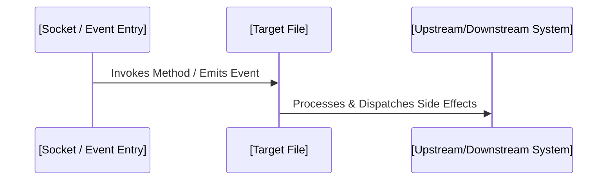

# TastyTails File Onboarding & Deep-Dive Analyzer Skill

> **Usage Instruction**: Invoke this skill whenever a developer or agent needs a comprehensive, high-clarity onboarding guide for a specific file in **TastyTails.net**. Generates a visual `onboarding_guide_[filename].md` artifact complete with Mermaid sequence diagrams, subsystem classification, performance safety ratings, and clickable symbol links.

---

## 1. Subsystem Classification Engine

During analysis, classify the target file into one of TastyTails.net's primary subsystems:
- **Server Engine**: Main 30Hz tick loop ([`src/server-loop.js`](file:///c:/Users/kkmcl/Documents/GitHub/tastytails.net/src/server-loop.js)), sliding collision ([`src/server/mapConfig.js`](file:///c:/Users/kkmcl/Documents/GitHub/tastytails.net/src/server/mapConfig.js)), AOI grid spatial hash.
- **Network Layer**: Socket.io packet listeners, payload serializers, LOD throttling, anti-cheat raycasting.
- **Combat & Anatomy**: Target Anatomy Forge ([`docs/ANATOMY_FORGE.md`](file:///c:/Users/kkmcl/Documents/GitHub/tastytails.net/docs/ANATOMY_FORGE.md)), limb hitboxes, medical remedies.
- **Database & Resilience**: Write-behind memory cache ([`src/classes/DatabaseResilience.js`](file:///c:/Users/kkmcl/Documents/GitHub/tastytails.net/src/classes/DatabaseResilience.js)), Mongoose schemas, offline backups.
- **Client & UI**: Phaser 3 scenes, Web Audio/MIDI synthesis, Universal Design Tokens ([`docs/UNIVERSAL_STYLE_GUIDE.md`](file:///c:/Users/kkmcl/Documents/GitHub/tastytails.net/docs/UNIVERSAL_STYLE_GUIDE.md)).

---

## 2. Mandatory Analysis Steps

### Step 1: Deep Inspection & Subsystem Classification
1. View target file contents completely using `view_file`.
2. Map all public exports, internal helper functions, state variables, and event listeners.
3. Assign subsystem classification and identify execution context (e.g. 30Hz main tick, async event handler, client render frame).

### Step 2: Call Graph & Trigger Tracing
Use `grep_search` across the workspace to map incoming triggers and downstream dependents:
- **Incoming Triggers**: What socket packets, tick updates, HTTP routes, or UI clicks trigger code in this file?
- **Upstream Dependencies**: What services, models, or math utilities does this file import?
- **Downstream Dependents**: What other files consume this file's exports?

### Step 3: Performance, Tick Budget & Safety Rating
Audit the file for performance impact:
- Is execution budgeted within the 33.3ms main loop tick window?
- Are database writes routed safely through `DatabaseResilience.js`?
- Are memory allocations managed efficiently to avoid garbage collection spikes?

---

## 3. Onboarding Guide Artifact Blueprint

Generate `onboarding_guide_[filename].md` with the following rich structure:

```markdown
# 📚 Developer Onboarding Guide: [File Name]

> **Subsystem**: [Subsystem Name] | **Execution Context**: [Main Tick / Socket Event / UI Frame]

## 1. TL;DR & Mental Model
- **Primary Purpose**: High-level summary (2-3 sentences).
- **Core Responsibilities**: Key duties of this file.
- **Mental Model**: Intuitive analogy explaining how the file operates.

## 2. Control Flow & Mermaid Sequence Diagram


## 3. Code & Symbol Deep Dive (Clickable Line Links)
- [`symbolName()`](file:///path/to/file.js#LXX-LYY):
  - **Purpose**: What it does.
  - **Inputs & Outputs**: Parameters and return types.
  - **Logic Overview**: Algorithm or state mutations.

## 4. Performance & Safety Rating
- **Tick Budget Impact**: Low / Medium / High (Budgeted for <33.3ms main loop).
- **Database Safety**: Uses `DatabaseResilience.js` write-behind cache / N/A.
- **Memory & Allocation Efficiency**: Notes on GC safety.

## 5. End-to-End Execution Scenario
- Walkthrough of a real-world scenario (e.g. "Player hits enemy with weapon").

## 6. Developer Modding & Extension Guide
- **How to Add Features**: Step-by-step instructions.
- **Gotchas & Edge Cases**: Traps to avoid.
- **Related Test Suites**: Relevant tests (`npm test`, `npm run test:auto`).
```

---

## 4. Core Execution Rules
- **No Guesses**: Never infer function signatures or data structures without viewing authoritative file contents.
- **Clickable Links**: All file and symbol references must use clickable markdown syntax (`[file.js](file:///path/to/file.js#L10)`).
